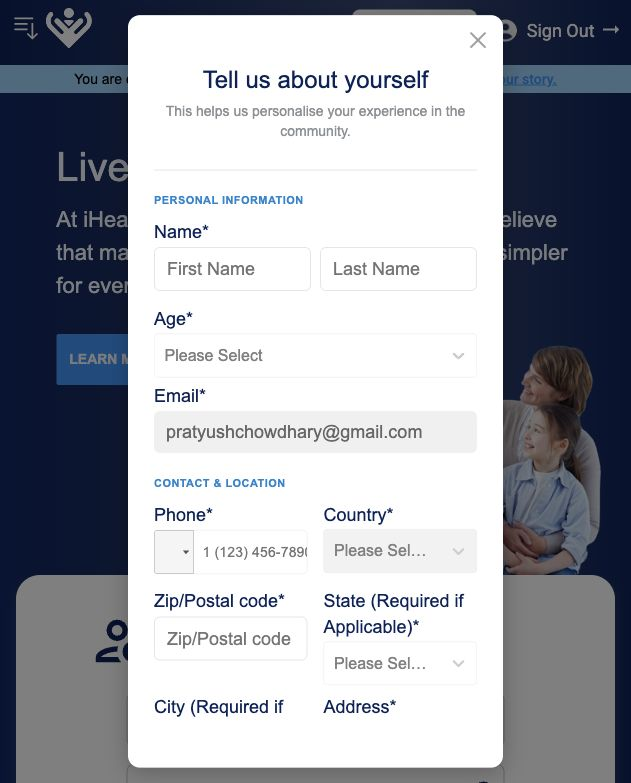

# User Registration - Agile User Stories

## Epic

As a new visitor to the iHealth and Wellness website, I want to complete the observed registration and verification flow so that I reach the signed-in profile completion step.

## User Journey

1. The user starts on the iHealth and Wellness home page.
2. The user clicks `Sign In`.
3. The user chooses the sign-up path.
4. The user enters account details.
5. The registration wizard shows the progress rail: `Account Setup`, `User Type`, `Security`, and `Profile`.
6. The user reaches the `Who are you joining as?` step.
7. The user selects a user type.
8. The user continues to the security step.
9. The user chooses a security question and answer.
10. The system sends an email verification message.
11. The user opens the verification email.
12. The user clicks `EMAIL VERIFICATION`.
13. The website opens from the verification link.
14. The user returns to the website in an authenticated state.
15. The user sees `Sign Out` in the header.
16. The user is prompted to complete their profile.

## Stories

### US-REG-01 - Start Registration From Sign In

As a new visitor, I want to start registration from the website `Sign In` entry point so that I can begin the observed registration flow.

Acceptance criteria:

- Given I am on the home page, when I click `Sign In`, then the authentication modal or form is displayed.
- Given I choose the sign-up path, when the registration form opens, then I can begin entering account details.

### US-REG-02 - Enter Account Credentials

As a new user, I want to enter my email and password so that the registration form can be completed.

Acceptance criteria:

- Given I am on the registration form, when I enter an email, password, and confirm password, then those fields are populated.

### US-REG-03 - Select User Type

As a new user, I want to select a user type so that the observed registration wizard can continue.

Acceptance criteria:

- Given the account setup step is complete, when the wizard shows `Who are you joining as?`, then the user type options are displayed.
- The observed user type options are `Patient`, `Healthcare Professional`, `Caregiver / Family`, `Supporter`, and `Internal User`.
- The `Patient` option is shown with the description `Living with NF`.
- The `Healthcare Professional` option is shown with the description `Medical provider or researcher`.
- The `Caregiver / Family` option is shown with the description `Caring for someone with NF`.
- The `Supporter` option is shown with the description `NF advocate or donor`.
- The `Internal User` option is shown with the description `iHealth`.
- Given a user type is selected, when the user clicks `CONTINUE`, then the flow proceeds to the next registration step.

### US-REG-04 - Set Security Question

As a new user, I want to select a security question and provide an answer so that the observed registration form can be completed.

Acceptance criteria:

- Given I am completing registration, when I open the security question field, then I see a list of available questions.
- Given I select a security question, when I enter an answer, then those fields are populated.

### US-REG-05 - Submit Registration

As a new user, I want to submit my registration details so that I receive the observed verification email.

Acceptance criteria:

- Given registration details are submitted, then the user receives a verification email.

### US-REG-06 - Receive Verification Email

As a new user, I want to receive the verification email so that I can continue the observed registration flow.

Acceptance criteria:

- Given registration is submitted, when I check my inbox, then I receive an email with subject `Verify Email Account`.
- The email is sent from `iHealth and Wellness Foundation <noreply@ihealthwellness.org>`.
- The email contains an `EMAIL VERIFICATION` call-to-action.
- The email explains that verification is required to complete the profile and access resources.

### US-REG-07 - Verify Email

As a new user, I want to click the email verification button so that the website opens from the verification link.

Acceptance criteria:

- Given I open the verification email, when I click `EMAIL VERIFICATION`, then the website opens with a verification token.
- Given the website opens from the verification link, then the user returns to the iHealth and Wellness website.

### US-REG-08 - Return To Website After Verification

As a verified user, I want to return to the website after verification so that I reach the observed signed-in state.

Acceptance criteria:

- Given I am authenticated, then the header shows `Sign Out`.

### US-REG-09 - Complete Profile After Registration

As a newly registered user, I want to complete my profile so that I can continue from the observed profile completion prompt.

Acceptance criteria:

- Given I am verified and authenticated, when the website loads, then I see a profile completion prompt.
- The profile form asks for basic personal and contact information, including first name, last name, email, phone, zip/postal code, and street name.
- The profile form includes location-related dropdown behavior, including state/city style selections.
- The email field is prefilled with the registered email address.

### US-REG-10 - Access Profile Settings After Registration

As a newly registered user, I want to access the site menu after registration so that I can see the observed `Profile & Settings` option.

Acceptance criteria:

- Given I am signed in, when I open the site menu, then I can see `Profile & Settings`.

## Evidence From Observed Flow

- Entry point observed: home page `Sign In`.
- Registration wizard observed:
  - Progress rail showed `Account Setup`, `User Type`, `Security`, and `Profile`.
  - User type screen title was `Who are you joining as?`.
  - User type options shown: `Patient`, `Healthcare Professional`, `Caregiver / Family`, `Supporter`, and `Internal User`.
  - `Patient` was shown as a selectable option with `Living with NF`.
  - `CONTINUE` button was shown on the user type step.
- Verification email observed:
  - Subject: `Verify Email Account`
  - Sender: `iHealth and Wellness Foundation <noreply@ihealthwellness.org>`
  - CTA: `EMAIL VERIFICATION`
- Post-verification state observed:
  - Website returned with verification token parameters.
  - Header showed `Sign Out`.
  - Profile completion form appeared.
- Profile continuation observed:
  - Profile form included personal and contact fields.
  - Location-related dropdown behavior was observed, including state/city style selections.
  - Header remained in signed-in state with `Sign Out`.
  - Opening the site menu exposed `Profile & Settings`.

## Screenshots

### Email Verification Email

Tester-provided screenshot shows the verification email with the `EMAIL VERIFICATION` CTA.

### Post-Verification Profile Prompt

Captured screenshot exists, but it contains visible personal email and phone data. Use a redacted version before sharing externally.

